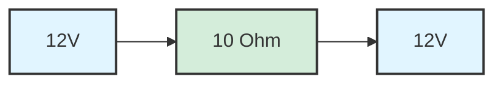

---
tags:
  - circuit-theory
module: Electricity & Electronics
component: Circuit Theory
permalink: electricity-electronics/circuit-theory-1
---
## Atoms
Outermost electron shell is called the valence shell, and the number of electrons in this shell is the valence. 

Electrons can be dislodged from their atoms and move freely. When a potential difference (voltage) is applied, these free electronics drift from one atom to another, creating an electric current.

If enough energy is supplied, and atom and lose or gain electrons. Losing electrons makes the atom positive charged, while gaining electronics makes it negatively charged – this process is called ionisation

## Insulators, Conductors & Semiconductors
Insulators are materials that resist the flow of electricity. In Insulators, the valence electrons are tightly bound and cannot be dislodged easily.

Conductors are the opposite of insulators. They allow electricity to flow easily, as the valence electrons are loosely bound and can be dislodged easily.

Semiconductors have 4 electrons in their outer shell. They may act as conductors or insulators based on external factors, like voltage applied or chemical impurities. 

## Electricity
Electricity and electrical circuits are like a water pipe. [[Circuit Theory (1)#Voltage|Voltage]] is the pressure of the water, [[Circuit Theory (1)#Current|Current]] is the dimension of the pipe and [[Circuit Theory (1)#Resistance|Resistance]] is like sand or rocks in the pipe.

> [!figure] ![[Electricity water hose.png]]
> © freeingenergy.com [^1]

## Current
When electrons flow through a complete circuit, this movement is called an electric current.. Current is measured in amperes ($A$), $1A$ is equal to one coulomb of charge passing a point each second.

In formulas, current typically uses the letter $I$.

**Related Formula**
* Given [[Circuit Theory (1)#Charge|Charge]] and Time: $I = \frac{Q}{t}$
* Given [[Circuit Theory (1)#Resistance|Resistance]] and [[Circuit Theory (1)#Voltage|Voltage]]: $I = \frac{R}{V}$ 
* Given [[Circuit Theory (1)#Power|Power]] and [[Circuit Theory (1)#Voltage|Voltage]]: $I=\frac{P}{V}$

Current only flows when there is a **potential difference** – eg, the voltage on one side is different to the voltage on the other. **In the following circuit, the current through the resistor will be zero!**

## Charge
Charge is the strength of how a particle interacts with electromagnetic fields, measured with the unit of **Coulomb** ($C$). A single electron carries a charge of $-1.6 \times 10^{-19}C$ while protons carry the same charge but positive.

Because electrons are so small, it is more useful to talk about large groups of the – one coulomb of charge is equal to $6.25 \times 10^{18}$  electrons. 

In formulas, charge typically uses the letter $Q$.

**Related Formula**
If current flows for a certain time, the total charge can be calculated as $Current \times Time$. When charge moves through a potential difference, charge can be calculated as $\frac{E}{V}$.

* Given [[Circuit Theory (1)#Current|Current]] and Time: $Q=I \times t$
* Given [[Circuit Theory (1)#Energy|Energy]] and [[Circuit Theory (1)#Voltage|Voltage]]: $Q = \frac{E}{V}$

## Energy
Energy is the capacity to cause change in a system - the ability to do work by moving something against a force or transferring heat. Energy is measured in **Joules** ($J$), both in electronics and mechanical systems. 

One joule is the energy transferred when a force of $1N$ moves an object through $1M$. 

In formulas, energy typically uses the letter $E$, but also uses $W$.

> [!WARNING] Be careful, this isn't the same $W$ as in Watt

**Related Formula**
* Given [[Circuit Theory (1)#Voltage|Voltage]] and [[Circuit Theory (1)#Charge|Charge]]: $E=V \times Q$
* Given [[Circuit Theory (1)#Voltage|Voltage]], [[Circuit Theory (1)#Current|Current]] and Time: $E=V \times I \times t$

## Voltage
Voltage is the measure of electrical potential energy between two points in a circuit, measured in **Volts** ($V$). One volt is defined as $1J$ transferred per coulomb of charge:  $1\ V= \frac{1J}{1C}$

In formulas, voltage typically uses the letter $V$.

**Related Formula**
* Given [[Circuit Theory (1)#Energy|Energy]] and [[Circuit Theory (1)#Charge|Charge]]: $V=\frac{E}{Q}$
* Given [[Circuit Theory (1)#Current|Current]] and [[Circuit Theory (1)#Resistance|Resistance]]: $V=I \times R$
* Given [[Circuit Theory (1)#Power|Power]] and [[Circuit Theory (1)#Current|Current]]: $V=\frac{P}{I}$

## Resistance
Resistance is the property of a material or component that opposes the flow of electric current, measured in **Ohms** ($\Omega$). One ohm is defined as the resistance that allows $1A$ of current to flow when $1V$ is applied across it: $1\Omega=\frac{1V}{1A}$

Resistance determines how much a component "resists" the movement of charge - higher resistance means less current flows for a given voltage. It's analogous to friction in mechanical systems: just as friction opposes motion and dissipates energy as heat, resistance opposes current flow and dissipates electrical energy as heat.

In formulas, resistance typically uses the letter $R$.

**Related Formula**
* Given [[Circuit Theory (1)#Voltage|Voltage]] and [[Circuit Theory (1)#Current|Current]]: $R=\frac{V}{I}$
* Given [[Circuit Theory (1)#Power|Power]] and [[Circuit Theory (1)#Current|Current]]: $R=\frac{P}{I^2}$
* Given [[Circuit Theory (1)#Voltage|Voltage]] and [[Circuit Theory (1)#Power|Power]]: $R=\frac{V^2}{P}$

## Electromotive Force
Electromotive Force (EMF) is the property of an energy source that drives electrical charge around a circuit. It is the "push" inside a battery/generator that makes electrons move.

Although it is called a force, EMF is actually measured as potential difference in **volts**. In practice, EMF represents the maximum voltage a source can provide when no current is flowing. Once a load is connected and current flows, some of the source voltage is lost to internal resistance, but the EMF is the origin of all current in the circuit.

It is measured across the terminals of the source when no current is flowing.

## Power
Electrical components are given a power rating, measured in **Watts** ($W$).  This shows the maximum rate at which the component can convert electrical energy into other forms such as heat, light or motion.

If energy is the ability to do work, then power is the rate of doing work.

In formulas, power typically uses the letter $P$.

Sometimes $I$ or $V$ is not known – use [[Circuit Theory (2)#Ohm's Law|Ohm's Law]] ($V=IR$) to find alternatives.

**Related Formulas**
* Given [[Circuit Theory (1)#Current|Current]] and [[Circuit Theory (1)#Voltage|Voltage]]: $P = I \times V$
* Given [[Circuit Theory (1)#Voltage|Voltage]] and [[Circuit Theory (1)#Resistance|Resistance]]: $P=\frac{V^2}{R}$
* Given [[Circuit Theory (1)#Current|Current]] and [[Circuit Theory (1)#Resistance|Resistance]]: $P = I^2 \times R$

[^1]: https://www.freeingenergy.com/understanding-the-basics-of-electricity-by-thinking-of-it-as-water/
