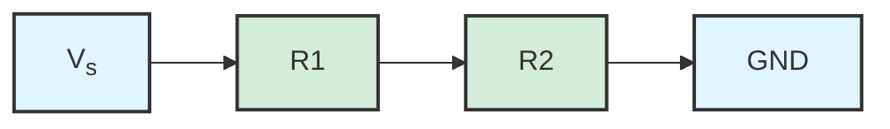
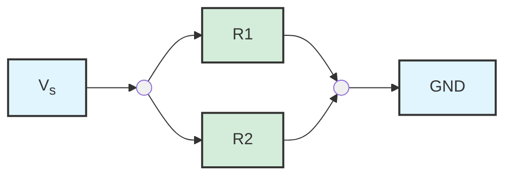
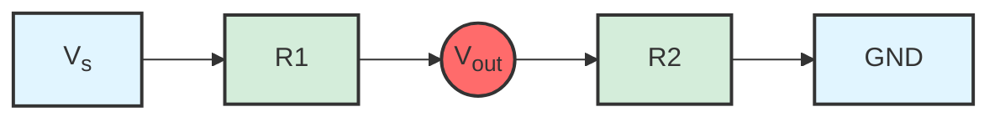
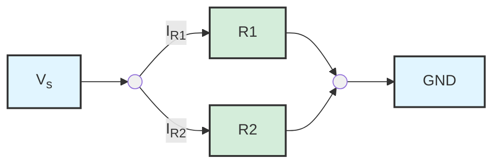

---
tags:
  - circuit-theory
module: Electricity & Electronics
component: Circuit Theory
permalink: electricity-electronics/circuit-theory-2
---
![[SI Units#Assumptions on Ranges]]

![[Circuit Theory (1)#Power]]

> [!TIP] When applying to real world applications - remember:
>  - **Heaters & other loads:** usually specified by $P=I^2 \times R$ since resistance is fixed
>  - **Power lines:** losses estimated by $P=I^2 \times R$ to show why reducing current (by using high voltage) is efficient

## DC vs AC

**Direct Current (DC)** flows in **one direction only**. It provides a steady voltage, which is why most electronics depend on it . Common sources include batteries, solar panels, fuel cells, and it is used in devices like phones, laptops and EVs.

**Alternating Current (AC)** changes direction periodically, as does the voltage. In the UK, mains supply alternates between $-230V$ and $+230V$ at $50\ Hz$ (50 times per second). It is ideal for delivering power over long distances.

Many low power devices (relative to appliances like heaters, cookers, kettles etc) take in AC from mains but immediately convert to DC.

## Resistors

Resistors are one of the most common components – they resist the flow of electrical current by turning some of the energy into heat. This helps you control how much current moves through different parts of a circuit. [[Circuit Theory (1)#Resistance|Resistance]] is measured in Ohms ($\Omega$).

Resistors come in two types:

* **Fixed**: the resistance never changed
* **Variable:** the resistance can be adjusted mechanically (aka potentiometers)

The amount of resistance a material provides depends on factors like it's **length, cross-sectional area and the type of material**. A long, thin wire of poor conductor material will have a much higher resistance than a short, thick copper wire.

Resistors are affected by temperature – as they warm up, their resistance changes. To account for this, resistors come in different tolerances. Most general purpose resistors have tolerances between $\pm1\%$ and $\pm10\%$. For example, a $100 \Omega$ resistor with a 5% tolerance could be anywhere between $95 \Omega$ and $105 \Omega$. 

Resistors with very low tolerances ($\leq2\%$) are called **precision resistors**.

### Resistor values

Resistors come in **preferred values**. These are a chosen set of numbers that are spread out across the possible range (see [[E series of preferred numbers]]). For example, in **E24** series, there are 24 values on in each decade of resistance (between $10 \Omega$ and $100 \Omega$).

To identify the resistance, a colour code system is used.

![[Electronic color code]]

### Resistors in Series

When resistors are connected one after another, this is known as a **series** connection. The total resistance is the sum of each resistor:

$$
R_{t}=R_{1}+R_{2}+R_{3}+\dots
$$

In this arrangement, the same current flows through every resistor because there is only one path. However, the voltage across each resistor is different. This is called **voltage drop** - each resistor consumes a portion of the voltage.

The bigger the resistance, the bigger the share of voltage it drops. By adding up all the voltage drops together, you'll always get back to the supply voltage:

$$
V_{s}=V_{R1}+V_{R2}+V_{R3}+\dots
$$
### Resistors in Parallel

When resistors are connected in parallel, each resistor has its own connection to the voltage source, so **voltage is the same across every resistor**.

In this arrangement, the **current** splits, with more current flowing through smaller resistances:

$$
I_{R1}=\frac{V}{R_{1}} \qquad I_{R2}=\frac{V}{R_{2}}
$$

Remember that the total current is equal to the sum of branch currents:

$$
I_{t}=I_{1}+I_{2}+I_{3}+\dots
$$

As a result, the total resistance of a parallel network is always less than the smallest resistor, because multiple paths make it easier for current to flow.

> [!TIP] Calculate $I_{R1}$ without voltage
> You can derive [[Circuit Theory (2)#Current Divider Formula|an alternative formula]] to calculate $I_{R1}$  without knowing the voltage

## Ohm's Law

Ohm's Law describes the fundamental relationship between [[Circuit Theory (1)#Voltage|Voltage]], [[Circuit Theory (1)#Current|Current]] and [[Circuit Theory (1)#Resistance|Resistance]].

$$
V=IR
$$

> [!INFO] Formula book gives different arrangement
> Ohm's Law is included in the formula book, but arranged as $R=\frac{V}{I}$

## Short Circuit

A short circuit happens when current takes an unintended path with little or no resistance. THis usually occurs if two points in a circuit that should be separate accidentally touch - for example because of faulty wiring or wrong connection. 

Because there is almost no resistance, the current can rise dramatically. This excessive current generates heat, which can damage components, melt wires and even cause fires.

Short circuits are a serious fault, and why protective devices like fuses and circuit breakers are essential in electrical systems.

## Voltage Divider

A voltage divider makes use of the way **voltage is shared** across resistors in series. By connecting two resistors in series, we can "tap" the circuit at the junction to create a new voltage which is a fraction of the supply.

Because the current is the same in both resistors, we can use [[Circuit Theory (2)#Ohm's Law|Ohm's Law]] to find the voltage across each one:

$$
I=\frac{V}{R_{1} + R_{2}}
$$

The voltage is shared, so can calculate $V_{out}$ with:

$$
V_{out}=V_{s} \times \frac{R_{2}}{R_{1} + R_{2}}
$$

## Current Divider

Two resistors $R_{1}$ and $R_2$ are in parallel. There is the same voltage $V$ across both resistors, while total current $I_{t}$ splits into $I_{R1}$ and $I_{R2}$. 

> [!WARNING] The formula for calculating $I_{Rx}$ without $V$ is not included in the formula book!

### Current Divider Formula
There is an alternative formula for calculating $I_{R1}$ without $V$ which can be derived through substitution.

**1. Current through R1 and R2**

$$
I_{R1} = \frac{V}{R_{1}} \qquad I_{R2} = \frac{V}{R_{2}}
$$

**2. Total current (Kirchhoff's Current Law)**

$$
I_{t}=I_{R1}+I_{R2}=\frac{V}{R_{1}}+\frac{V}{R_{2}}
$$
**3. Solve for V**

$$
V=\frac{I_{t}}{\frac{1}{R_{1}}+\frac{1}{R_{1}}}
$$
**4. Substitute back into** $I_{R1}=\frac{V}{R_{1}}$

$$
I_{R1}=[\frac{I_{t}}{\frac{1}{R_{1}}+\frac{1}{R_{2}}}] \times \frac{1}{R_{1}} = I_{t}\ \times [\frac{\frac{1}{R_{1}}}{\frac{1}{R_{1}}+\frac{1}{R_{2}}}]
$$

**5. Rearrange to alternative form:**

$$
I_{R1} = I_{t}\ \times \frac{R_{2}}{R_{1}+R_{2}}
$$

### Worked example

For example, make $R_{1} = 50 \Omega$ and $R_{2}=100 \Omega$. Find the current flowing through each when the source has a current of $20A$:

$$
I_{R1} = 20 \times \frac{100}{100 + 50} = 13.33A
$$
$$
I_{R2} = 20 \times \frac{50}{100 + 50} = 6.66A
$$

> [!TIP] Check $I_{R1} + I_{R2} = I_{t}$
> The sum of current across each resistor should be equal to the source current

